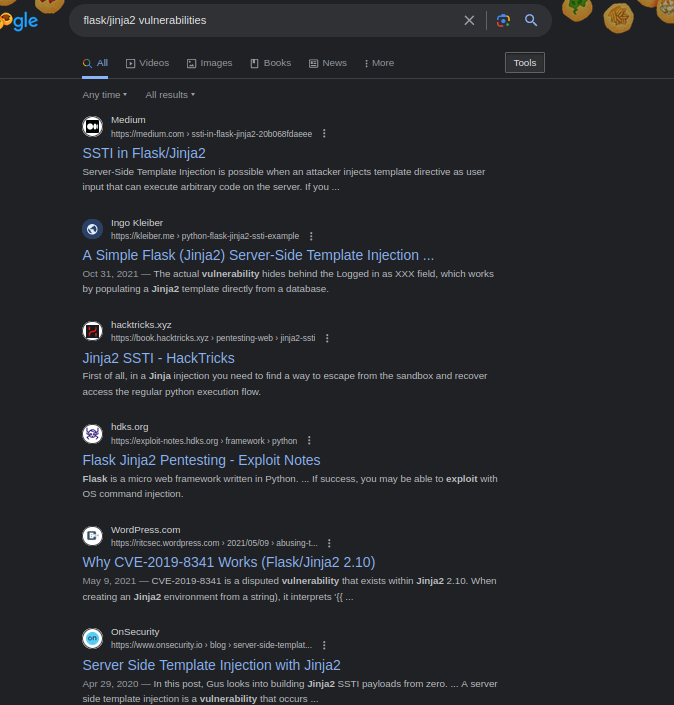

## Introduction

In preparation for OffSec's OSWE exam, I will be going through some of the active web challenges on HackTheBox. Templated is an easy rated challenge that focuses on a SSTI vulnerability in the Jinja2 templating engine.&#x20;

<figure><figcaption></figcaption></figure>

## Enumeration

After spinning up the machine and visiting the web page we can see that the site is not configured.

<figure><figcaption></figcaption></figure>

The only valuable information from here is that the site is being run on flask/jinja2. Flask is a web application framework written in Python and utilizes Jinja2 as its templating engine.&#x20;

A quick google search for "flask/jinja2 vulnerabilities" shows that Jinja2 might be vulnerable to SSTI (Server Side Template Injection).&#x20;

<figure><figcaption></figcaption></figure>

Before acting on this, I'll continue to do basic web enumeration. With such a small attack surface it's a good idea to try to discover new content using a tool like [feroxbuster](https://github.com/epi052/feroxbuster).&#x20;

<figure><figcaption></figcaption></figure>

Feroxbuster does not return any valuable results. The '200' responses are from URLs with spaces (%20) in them, but they do not actually exist. The rest are also false positives.&#x20;

Without much to go off of, we can start out testing from the one input point that we can control, the URL.&#x20;

<figure><figcaption></figcaption></figure>

By manually browsing to a page we can see that the path is reflected on the web page. This is worth noting as it means that user provided input is processed by the web server (in Python) and then reflected back to the browser. This can be vulnerable to many different vulnerability types depending on the processing that is happening on the backend.&#x20;

With this in mind I'll look into the server-side template injection that was mentioned earlier.

## Server-Side Template Injection (SSTI)

From PortSwigger:

> Template engines are widely used by web applications to present dynamic data via web pages and emails. Unsafely embedding user input in templates enables [Server-Side Template Injection](https://portswigger.net/web-security/server-side-template-injection), a frequently critical vulnerability that is extremely easy to mistake for [Cross-Site Scripting](https://portswigger.net/web-security/cross-site-scripting) (XSS), or miss entirely. Unlike XSS, Template Injection can be used to directly attack web servers' internals and often obtain Remote Code Execution (RCE), turning every vulnerable application into a potential pivot point.

To detect this vulnerability and differentiate it from a simple XSS,  a payload can be used that will actually be processed by the templating engine, Jinja2.

The payload `{{7*7}}` should reflect '49' on the page if it is vulnerable.&#x20;

<figure><figcaption></figcaption></figure>

With the SSTI being confirmed we can start to develop the payload to (hopefully) gain RCE.&#x20;

## RCE

The Jinja2 engine does limit what can be injected. For instance, `{{ ls }}` and `{{ import os; os.system("ls") }}` are not going to work. Although, it does allow for the use of built-in python methods. A simple example is using a string manipulation method like `.upper` to see that `{{"test".upper()}}` gets reflected as `TEST`.&#x20;

<figure><figcaption></figcaption></figure>

With this knowledge, I will call the `self` variable and access the "magic" methods. The `self` variable is just a reference to the current instance of the class. Magic methods are methods that start and end with double underscores and allow instances of classes to interact with built-in functions. Below is the updated payload:


```
http://targetip:port/{{ self.__init__.__globals__.__builtins__ }}
```


<figure><figcaption></figcaption></figure>

The payload has successfully broken out of the "jail" it was in. To further develop this, the desired module (in this case, `os`) can be imported and the OS command passed to `popen()` method.&#x20;

At this point, the payload is able to execute arbitrary commands on the system as root.&#x20;


```
http://targetip:port/{{self.__init__.__globals__.__builtins__.__import__('os').popen('id').read() }}
```


<figure><figcaption></figcaption></figure>

From here, all that's left to do is grab the flag.

<figure><figcaption></figcaption></figure>

I hope this has been helpful and feel free to message me on Twitter or LinkedIn if you have any questions.&#x20;

## References

<https://book.hacktricks.xyz/pentesting-web/ssti-server-side-template-injection/jinja2-ssti>

<https://github.com/swisskyrepo/PayloadsAllTheThings/blob/master/Server%20Side%20Template%20Injection/README.md#jinja2---remote-code-execution>

<https://www.tutorialspoint.com/python/os_popen.htm>

<https://jinja.palletsprojects.com/en/3.1.x/>

<https://portswigger.net/research/server-side-template-injection>

<https://mathspp.com/blog/pydonts/dunder-methods>
